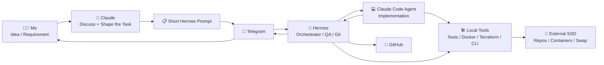
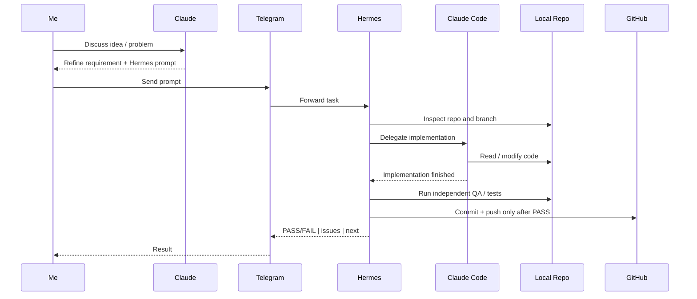

# 🤖 My Always-On AI DevOps Worker

## How I turned a cheap thin client into a 24/7 Hermes + Claude + Telegram coding system

## 👋 Why I built this

I'm a DevOps engineer, and a surprising amount of my time goes into work that is important but repetitive:

- patching servers
- checking CI/CD failures
- fixing scripts
- updating Terraform
- running tests
- checking branches
- troubleshooting tooling
- building small utilities for recurring operational tasks

None of these jobs necessarily needs hours of deep architecture work.

But they still make me open a laptop, find the right repository, understand the current state, make a change, test it, commit it, push it, and check that everything actually worked.

Do that often enough and the overhead becomes the problem.

So I started thinking:

> **What if I had an AI coding worker available 24/7 that I could give work to from anywhere?**

I did not want another chatbot that required me to stay in front of it.

I wanted a small always-on Linux machine that could receive a task, coordinate a coding agent, verify the result, manage Git, and report back to me.

That became this setup.

I took a refurbished **Dell Wyse 5070**, installed Ubuntu, added a few inexpensive hardware upgrades, and turned it into an always-on DevOps agent host.

The system combines:

**Telegram + Hermes Agent + Claude + Claude Code + GitHub + local DevOps tools**

---

# ⚡ The idea in one picture



The key idea is simple:

> **Claude helps me decide what to build. Claude Code builds it. Hermes makes sure the job is actually finished.**

---

# 🧩 How I actually use it

My workflow normally starts with a conversation with **Claude**.

I explain the idea or problem and we work through things like:

- expected behavior
- implementation boundaries
- what should not change
- likely failure points
- how much testing is appropriate

Once the task is clear, Claude gives me a **short implementation prompt for Hermes**.

I send that prompt through Telegram.

From that point onward, Hermes owns the workflow.

Hermes can:

- inspect the repository state
- launch the coding agent
- wait for the implementation
- run its own QA
- verify the changed behavior
- inspect Git status
- commit only when the result passes
- push the branch
- report PASS/FAIL and the next action back to Telegram

The coding agent is deliberately **not** responsible for declaring its own work complete.

That gives me a lightweight separation of responsibilities:

> **The agent writing the code is not the same layer deciding whether the task is done.**

---

# 📋 A real Claude → Hermes prompt

Here is an actual example of the kind of prompt I send.


The prompt is intentionally short:

```text
On feature/patch-all: after app restart, an analysis left RUNNING is not
marked INTERRUPTED and Analyze/Patch stay disabled. Startup recovery from
faa2ae6 isn't working on a real DB (schema v7, existing runs). Fix + test
with a DB containing a RUNNING analysis before startup.
Full suite + ruff. Commit after PASS, push. Report PASS/FAIL | issues | next.
```

By the time Hermes receives this, Claude and I have already discussed the problem.

Hermes does not need a giant specification. It needs a clear objective, validation conditions, and the rules for completing the job.

---

# 🧪 Hermes does the QA and Git management

Here is the other half of the workflow.


In this example Hermes did not simply accept the coding agent's result.

It exercised the fallback path, started the required containers, reran the integration test against that environment, cleaned up, and then handled the commit.

That behavior is important to me.

I want the coding model spending its intelligence on implementation.

I want Hermes doing the repetitive orchestration around it:

```text
implement
   ↓
verify
   ↓
test
   ↓
inspect
   ↓
commit
   ↓
push
   ↓
report
```

---

# 💬 Why Telegram?

Telegram is effectively my remote control.

I can send a task from my phone and walk away.

For example:

```text
Check the latest branch.

Have Claude fix the regression.

Run the targeted tests.

If everything passes, commit and push.

Report PASS/FAIL, issues, and next step.
```

My phone is not doing any of the work.

The thin client is.

That means I do not need to keep my laptop awake, maintain a remote desktop session, or leave VS Code open.

---

# 🖥️ The hardware

My base machine is a refurbished **Dell Wyse 5070**.

| Component | Setup |
|---|---|
| Machine | Dell Wyse 5070 |
| CPU | Intel Celeron J4105 |
| RAM | 4 GB |
| Internal storage | 32 GB |
| OS | Ubuntu Linux |
| Role | 24/7 Hermes / DevOps orchestration host |

This is not a powerful workstation.

That is exactly why I like the design.

The thin client does not need to run the LLM locally. Its job is persistence, orchestration, storage, networking, Git, containers, and command execution.

The expensive reasoning happens in the cloud.

---

# 💾 Problem #1 — 32 GB of storage disappears fast

Once you start adding Docker, package caches, repositories, Python environments, logs, Terraform projects, and development tools, 32 GB gets uncomfortable very quickly.

So I added a **256 GB external SSD** and mounted it at:

```text
/data
```

I moved the storage-heavy workloads there:

```text
/data
├── docker
├── containerd
├── projects
└── swapfile
```

My project directory points to the SSD:

```text
~/projects -> /data/projects
```

Docker data:

```text
/data/docker
```

containerd data:

```text
/data/containerd
```

That keeps the tiny internal disk mostly focused on the operating system.

---

# 🧠 Problem #2 — 4 GB RAM

Four gigabytes is fine for a lightweight orchestration host until containers, package managers, tests, and coding tools all become active at the same time.

I added an **8 GB swap file on the SSD**:

```text
/data/swapfile
```

Swap is not RAM and I would not pretend otherwise.

But for this workload it gives the machine enough breathing room to survive temporary memory pressure without turning a cheap thin client into an expensive server project.

---

# 📡 Problem #3 — where I wanted the box was not where Ethernet was

I wanted the machine somewhere convenient where it could stay powered on.

So I added a **Linux-compatible USB Wi-Fi adapter**.

This was a tiny upgrade, but it made the system much easier to place and forget about.

For this kind of machine, Linux chipset compatibility matters more to me than flashy Wi-Fi specifications.

---

# 🛠️ What runs on the box

The thin client has become a small always-on DevOps workstation.

Some of the tools available locally include:

```text
Ubuntu Linux
Hermes Agent
Claude Code CLI

Git
Docker
containerd

Terraform
AWS CLI
kubectl
Helm

Python
Node.js
```

My repositories live under:

```text
~/projects
```

which is backed by:

```text
/data/projects
```

---

# 🔄 What happens when I send a task?



This is the workflow I was trying to achieve from the beginning:

**I can start useful coding work without opening my laptop.**

---

# 💡 Why not just run it on my laptop?

Because a laptop is a bad always-on server.

It:

- sleeps
- travels with me
- gets rebooted
- is used for other work
- is not always connected
- consumes more power than this tiny box needs

The Wyse just sits there.

Quietly.

Waiting for work.

---

# 💰 Why a cheap thin client works

The trick is understanding what actually needs compute.

My thin client handles:

- orchestration
- repositories
- Git
- command execution
- containers
- local development tools
- persistent storage
- networking

The LLM compute happens elsewhere.

So I do not need an expensive GPU server to make this workflow useful.

I need a boring, reliable Linux machine that is always available.

That is a much cheaper problem to solve.

---

# 🧩 The upgrades that mattered

| Limitation | What I changed |
|---|---|
| 32 GB internal storage | Added 256 GB external SSD |
| Docker filling the system disk | Moved Docker data to `/data/docker` |
| containerd storage | Moved it to `/data/containerd` |
| Development repos | Moved them to `/data/projects` |
| 4 GB RAM | Added 8 GB SSD-backed swap |
| Ethernet placement limitation | Added Linux-compatible USB Wi-Fi |

The useful lesson for me was:

> **Do not replace cheap hardware before you identify the actual bottleneck.**

For this workload, CPU power was not the main problem.

Storage, memory headroom, and connectivity were.

---

# 🔐 Security

This machine can execute commands and access repositories, so I treat it like a development server rather than a toy.

I deliberately do **not** publish:

```text
Telegram bot tokens
API keys
GitHub credentials
SSH private keys
PEM files
private repository names
internal IP addresses
service credentials
```

An always-on agent is useful precisely because it can take actions.

That also means credential hygiene matters.

---

# 🎯 What I ended up with

For relatively little money I now have:

- a 24/7 Ubuntu agent host
- Telegram remote control
- Hermes orchestration
- Claude for task design
- Claude Code for implementation
- independent QA after coding
- automated Git management
- GitHub integration
- local DevOps tooling
- persistent project storage
- a workflow that does not depend on my laptop being awake

The architecture is not complicated.

That is part of why I like it.

---

# 🚀 Final thoughts

This project started with a boring problem:

**too much repetitive DevOps overhead.**

Instead of automating one task at a time, I wanted a reusable worker that could help me create and maintain the tools I need.

The result is a small system with a clear division of labor:

> **I bring the idea. Claude helps shape it. Claude Code implements it. Hermes orchestrates, verifies, manages Git, and reports back.**

The thin client provides persistence.

Telegram provides access.

The cloud models provide intelligence.

A cheap box sitting quietly in my house became my **always-on AI DevOps worker**. 🤖
